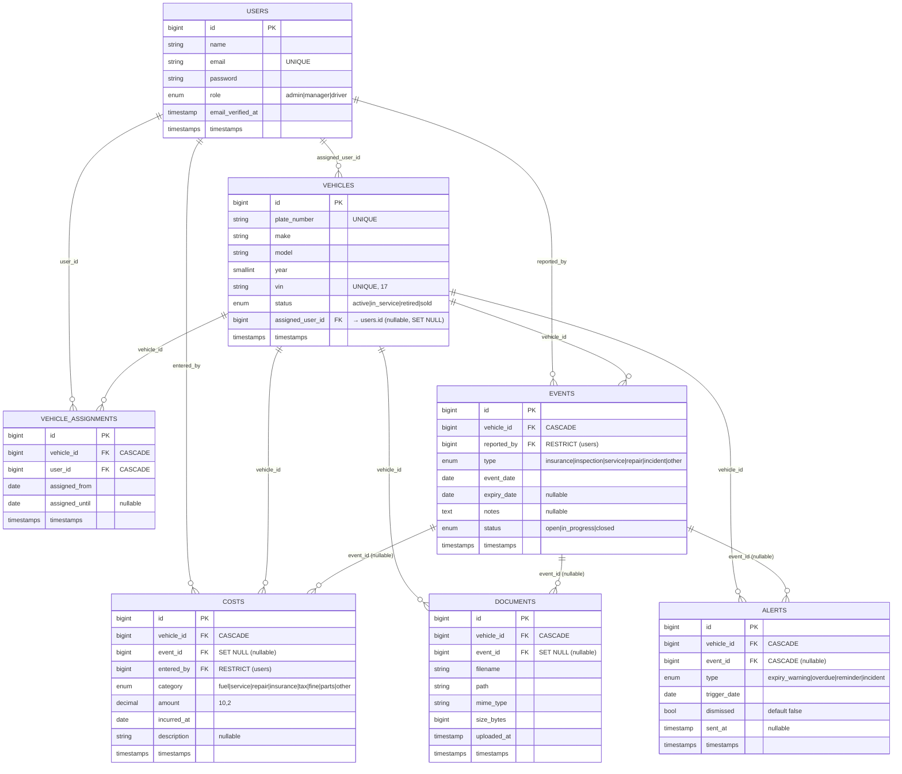

# Diagram ERD

Diagram klasyczny "Crow's Foot" zrealizowany w mermaid (GitHub i większość edytorów Markdown renderuje go natywnie).

## Interpretacja relacji

- **Użytkownik** może mieć przypisanych wiele pojazdów (kierowca aktualnie jeżdżący) — relacja 1:N przez `vehicles.assigned_user_id`. Historia przypisań trafia do `vehicle_assignments` (relacja N:M w czasie).
- **Pojazd** ma wiele zdarzeń (`events`), wiele kosztów, dokumentów i alertów.
- **Event** (zgłoszenie / serwis / ubezpieczenie / incydent) jest **opcjonalną kotwicą** dla kosztów, dokumentów i alertów. Dzięki `nullable + nullOnDelete` można usunąć event bez utraty powiązanego kosztu (np. faktura wciąż widoczna w raporcie).
- **Document** może być powiązany jednocześnie z pojazdem i z konkretnym zdarzeniem (np. zdjęcie z kolizji + faktura naprawcza).

## Polityka usuwania

| Relacja | Reguła | Powód |
|---------|--------|-------|
| `vehicles.assigned_user_id → users` | **SET NULL** | Usunięcie kierowcy nie kasuje pojazdu, wraca on do puli wolnych. |
| `events.reported_by → users` | **RESTRICT** | Nie pozwalamy usunąć usera, który ma zgłoszenia — wymusza re-przypisanie. |
| `costs.entered_by → users` | **RESTRICT** | Jak wyżej — koszt musi mieć autora dla audytu. |
| `vehicle_assignments.*` | **CASCADE** | Po usunięciu pojazdu/usera historia traci sens. |
| `events.vehicle_id` | **CASCADE** | Usunięcie pojazdu zamyka jego historię. |
| `costs.vehicle_id` | **CASCADE** | Jak wyżej. |
| `costs.event_id` | **SET NULL** | Koszt może istnieć niezależnie od konkretnego zgłoszenia. |
| `documents.*` | **CASCADE / SET NULL** | Dokumenty pojazdu giną z pojazdem; powiązanie z eventem może zniknąć. |
| `alerts.*` | **CASCADE** | Alerty nie mają sensu bez pojazdu. |
